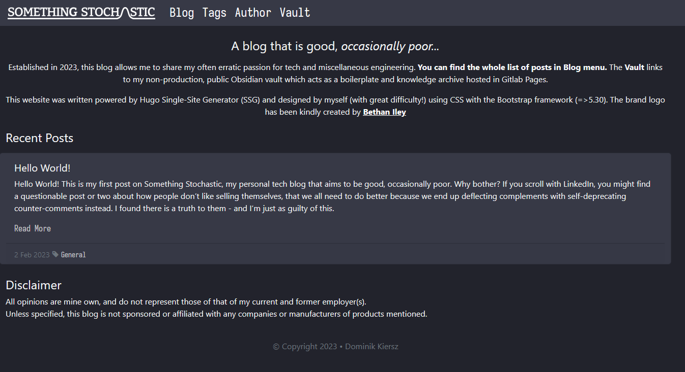

# Something Stochastic Hugo (Deprecated)

 

**Version:** 1.2.1

**Last Updated:** 7th October 2023

**Developer(s):** Dominik Kiersz

## Description

**This repository and website are now archived, with the domain transfered to my technical documentation website.**

Archived source code for `somethingstochastic.com`, my personal tech blog which never really took off.

The website was proudly built using Hugo and Bootstrap from scratch, and was hosted on was Azure. I learned a lot about web development and the Hugo framework - but WebDev and constantly upgrading this website, while having to jiggle between a public Obsidian vault and this website was no longer productive or motivating. Thus, a consolidation, and a migration to a low maintenance MkDocs website was a no brainer. This in turn will enable me to focus on things that matter to me more, like homelabbing or cloud.

Here is how the website looked like:

## Project Status

Deprecated

## Licence

[GNU GPLv3](https://www.gnu.org/licenses/gpl-3.0.en.html)